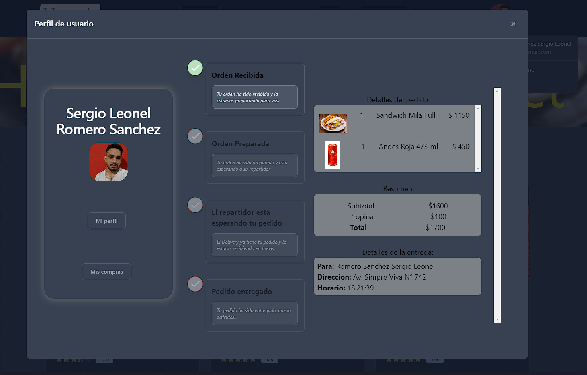

<h1 align="center">Hola 👋, soy Sergio Romero!</h1>
<h3 align="center">Full Stack Javascript Developer de Argentina</h3>

## ⚙️ Lenguajes y herramientas:

 

 

 

 

 

 

 

 

## 🚀 Proyectos Principales:

## 🥩 Henry's Resto Project:

<a href="https://restohenry.vercel.app/pedidos" target="_BLANK">
Henry's Resto Project
</a>
es un E-Comerce orientado a los pequeños y medianos restaurantes que quieren adentrarse a la venta online de una manera rapida y sencilla. 
En nuestra app, hay 3 roles principales los cuales se dividen en Usuario(Logged/not logged)/Admin/Repartidor. Cada rol cuenta con sus respectivos paneles, en los cuales pueden 
administrar su perfil a gusto.
En esta app contamos con loggeo por google o cuenta local, localizacion por GPS con motor de google MAP's API, Chat-BOT, Chat por Whatsapp, Modo Oscuro/Claro, datos persistentes en local storage, pagos a travez de Stripe, etc.

 
 

- Frontend: TypeScript, React, HTML, CSS, Tailwind.
- Backend: Node JS, Express, Sequelize, Firebase, Postgres, Axios.
- DataBase: MongoDB.
- Deploy: Vercel, Mongo.

  
  
  
  
  
  

## 🍔 Food's PI:

<a href="https://pi-foods-kohl.vercel.app/" target="_BLANK">
Food's Henry's PI
</a>
es un proyecto individual sobre recetas para el bootcamp Henry. En ella podras encontrar todo tipo de dietas, comidas, ademas de poder crear tu propia receta.
La misma cuenta con filtrados anidados, barra de busqueda, ruta de detalles, formulario de creacion, etc.
 
 
- Frontend: JavaScript, React TS, Redux, React-router-DOM, Redux Thunk, HTML, CSS.
- Backend: JavaScript, Node JS, Express, Sequelize.
- DataBase: SQL.
- Deploy: Vercel, Heroku.

  

## 📊 My Github Stats

 

  

 
 
 
 
 
 
 

## Connect with me:

  

